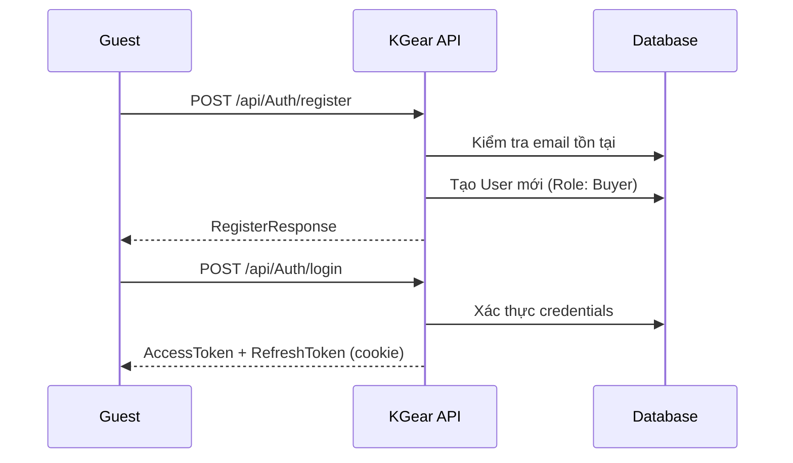
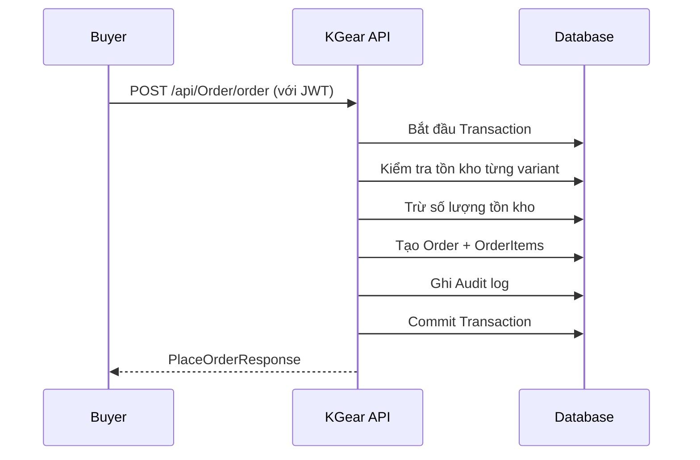

# KGear Backend - Use Case Diagram

## Tổng quan hệ thống

**KGear** là một hệ thống e-commerce bán gear gaming với các chức năng chính:
- Quản lý xác thực người dùng (Authentication)
- Quản lý sản phẩm (Product Management)
- Quản lý đơn hàng (Order Management)

---

## Actors

| Actor | Mô tả |
|-------|-------|
| **Buyer (Khách hàng)** | Người dùng đã đăng ký, có thể xem sản phẩm và đặt hàng |
| **Admin** | Quản trị viên hệ thống, có toàn quyền quản lý sản phẩm và xem tất cả đơn hàng |
| **Guest (Khách)** | Người dùng chưa đăng nhập, chỉ có thể đăng ký/đăng nhập và xem sản phẩm |

---

## Use Case Diagram

```mermaid
flowchart TB
    subgraph Actors
        Guest["👤 Guest"]
        Buyer["🛒 Buyer"]
        Admin["👨‍💼 Admin"]
    end

    subgraph AuthSystem["🔐 Authentication System"]
        UC1["Đăng ký tài khoản"]
        UC2["Đăng nhập"]
        UC3["Làm mới Token"]
    end

    subgraph ProductSystem["📦 Product Management"]
        UC4["Xem danh sách sản phẩm"]
        UC5["Tạo sản phẩm mới"]
        UC6["Cập nhật thông tin sản phẩm"]
        UC7["Cập nhật biến thể sản phẩm"]
        UC8["Xóa sản phẩm"]
        UC9["Xóa biến thể sản phẩm"]
    end

    subgraph OrderSystem["🛍️ Order Management"]
        UC10["Đặt hàng"]
        UC11["Xem chi tiết đơn hàng"]
        UC12["Xem danh sách đơn hàng của tôi"]
        UC13["Xem tất cả đơn hàng"]
    end

    %% Guest connections
    Guest --> UC1
    Guest --> UC2
    Guest --> UC4

    %% Buyer connections
    Buyer --> UC2
    Buyer --> UC3
    Buyer --> UC4
    Buyer --> UC10
    Buyer --> UC11
    Buyer --> UC12

    %% Admin connections
    Admin --> UC2
    Admin --> UC3
    Admin --> UC4
    Admin --> UC5
    Admin --> UC6
    Admin --> UC7
    Admin --> UC8
    Admin --> UC9
    Admin --> UC11
    Admin --> UC13
```

---

## Chi tiết Use Cases

### 🔐 Authentication Module

| Use Case | Actor(s) | Mô tả | API Endpoint |
|----------|----------|-------|--------------|
| **UC1: Đăng ký tài khoản** | Guest | Người dùng mới tạo tài khoản với email, password, tên và địa chỉ | `POST /api/Auth/register` |
| **UC2: Đăng nhập** | Guest, Buyer, Admin | Xác thực bằng email/password, nhận JWT token | `POST /api/Auth/login` |
| **UC3: Làm mới Token** | Buyer, Admin | Dùng refresh token để lấy access token mới | `POST /api/Auth/refresh` |

---

### 📦 Product Management Module

| Use Case | Actor(s) | Mô tả | API Endpoint |
|----------|----------|-------|--------------|
| **UC4: Xem danh sách sản phẩm** | Guest, Buyer, Admin | Lấy danh sách sản phẩm với phân trang cursor | `GET /Product` |
| **UC5: Tạo sản phẩm mới** | Admin | Tạo sản phẩm với nhiều biến thể và hình ảnh | `POST /Product/create` |
| **UC6: Cập nhật thông tin sản phẩm** | Admin | Cập nhật tên, mô tả, thương hiệu của sản phẩm | `PUT /Product/{productId}/info` |
| **UC7: Cập nhật biến thể sản phẩm** | Admin | Cập nhật tên, giá, tồn kho, SKU của biến thể | `PUT /Product/{productId}/variants/{variantId}` |
| **UC8: Xóa sản phẩm** | Admin | Soft delete sản phẩm (đặt IsActive = false) | `DELETE /Product/{productId}` |
| **UC9: Xóa biến thể sản phẩm** | Admin | Soft delete biến thể sản phẩm | `DELETE /Product/{productId}/variants/{variantId}` |

---

### 🛍️ Order Management Module

| Use Case | Actor(s) | Mô tả | API Endpoint |
|----------|----------|-------|--------------|
| **UC10: Đặt hàng** | Buyer | Tạo đơn hàng mới với danh sách sản phẩm và địa chỉ giao hàng | `POST /api/Order/order` |
| **UC11: Xem chi tiết đơn hàng** | Buyer, Admin | Buyer chỉ xem đơn của mình, Admin xem tất cả | `GET /api/Order/{orderId}` |
| **UC12: Xem đơn hàng của tôi** | Buyer | Xem danh sách đơn hàng của chính mình | *(Trong OrderService.ViewUserOrdersAsync)* |
| **UC13: Xem tất cả đơn hàng** | Admin | Xem toàn bộ đơn hàng trong hệ thống | *(Trong OrderService.ViewAllOrderListAsync)* |

---

## Luồng nghiệp vụ chính

### 1. Luồng đăng ký và đăng nhập

### 2. Luồng đặt hàng

---

## Ghi chú kỹ thuật

- **Authentication**: Sử dụng JWT với Access Token + Refresh Token (HttpOnly Cookie)
- **Authorization**: Phân biệt quyền dựa trên `UserRole` (Buyer/Admin)
- **Soft Delete**: Products và Variants sử dụng cờ `IsActive` thay vì xóa vật lý
- **Media Storage**: Hình ảnh được upload lên Cloudinary
- **Pagination**: Sử dụng cursor-based pagination cho hiệu suất tốt hơn
